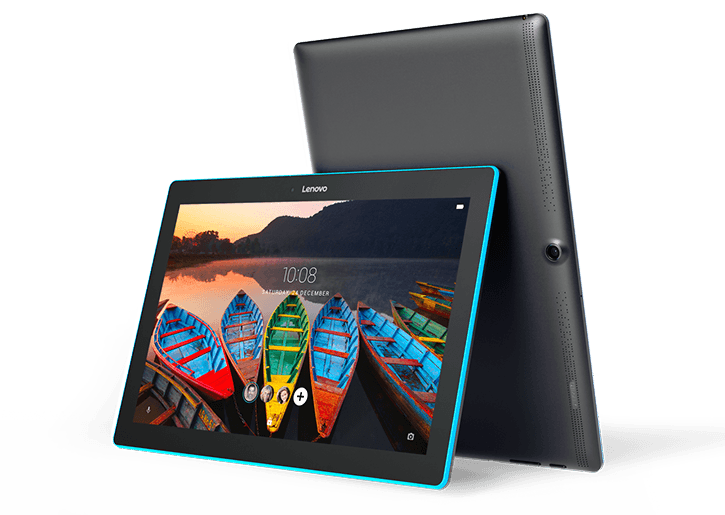
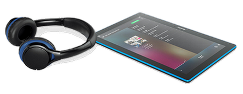

<!DOCTYPE HTML">
<html>
 <head>
<link rel="stylesheet" href="style1.css">
 		<meta name="description" content="Страница товара с веб-магазина">
  		<meta http-equiv="Content-Type" content="text/html; charset=utf-8">
  			<title>Інтернет-магазин</title>
 </head>
<!--Задание стилей для списка в форме меню (верхняя панель)-->
<h1><a href="https://www.lenovo.com/ru/ru/tablets/android-tablets/tab-series/Lenovo-Tab-10/p/ZZITZTATB7F">Планшет Lenovo Tablet 10 4/64GB Black</a></h1>
    

<h1>Планшет для дружной семьи</h1>

    

        
ОТЛИЧНАЯ КАРТИНА ПОД ЛЮБЫМ УГЛОМ

        
Пусть ничто не отвлекает от просмотра. Планшет с 10,1-дюймовым дисплеем с разрешением (1280 x 800) прекрасно подходит для просмотра любимых шоу и видео с сервисов Netflix и YouTube. Благодаря технологии IPS фотографии и видеоролики остаются четкими и яркими под любым углом. Высокое качество картинки гарантировано,даже если за планшетом соберется вся семья.

    

    

 

    

        
ИСПОЛЬЗУЙТЕ СОВМЕСТНО - НО ОГРАДИТЕ ЛИЧНОЕ ПРОСТРАНСТВО

        
Каждый член семьи может использовать планшет Lenovo Tab 10 в соответствии с личными потребностями и интересами. Каждый пользователь может создать собственную учетную запись с индивидуальным паролем, настройками, обоями и аккаунтами в социальных сетях.

    

    

    
 
        
ЗАЩИТА ДЕТЕЙ

        
Активировав специальный «детский» режим, родители могут заблокировать ребенку доступ к нежелательному контенту и ограничить времяиспользования устройства.

    

    

    

        
РАЗВЛЕКАЙТЕСЬ КАЖДЫЙ ДЕНЬ

        
Поскольку планшет Lenovo Tab 10 предназначен для всей семьи, то использоваться он будет постоянно. Но благодаря аккумулятору большой емкости гарантировано 10 часов работы устройства без подзарядки.

    

    

<!--Список--> 

    
В комплекте

    <ul >
    <li class="komplekt">Планшет Lenovo Tab 10</li>
    <li class="komplekt">Зарядное устройство и USB-кабель</li>
    <li class="komplekt">Зарядное устройство и USB-кабель</li>
    <li class="komplekt">Краткое руководство пользователя</li>
    <li class="komplekt">Салфетка для протирки*  <small>*Для определенных стран</small></li>
    </ul>

<!--Таблица--> 

Технические характеристики

<table  class="tabl"  align="center" width="90%" cellpadding="25" cellspacing="0" border="0" rules="groups">
<colgroup width="250">
    <colgroup width="350">
   <col span="2">
   <col span="3">
</colgroup>
<tr>
    <td bordercolor=black; width="250"> Процессор</td>
    <td class="tabl_right">Четырехъядерный процессор Qualcomm® Snapdragon™ 210 1,3 ГГц</td>
   </tr>
<tr>
    <td>Операционная система</td>
    <td class="tabl_right">Android 6.0</td>
</tr>
<tr>
    <td>Аккумулятор</td>
    <td class="tabl_right">До 10 часов*</td>
</tr>
<tr>
    <td>Дисплей</td>
    <td class="tabl_right">10,1-дюймовый сенсорный дисплей стандарта HD (1280 x 800) с матрицей IPS</td>
</tr>
<tr>
    <td>Накопитель</td>
    <td class="tabl_right">Внутренняя память 16 ГБ + поддержка карты microSD до 64 ГБ</td>
</tr>
<tr>
    <td>Средства коммуникации</td>
    <td class="tabl_right">Wi-Fi 802.11 b/g/n</td>
</tr>
<tr>
    <td>Вес</td>
    <td class="tabl_right">570 г</td>
</tr>
<tr>
    <td>Габариты</td>
    <td class="tabl_right">247 x 171 x 9,6 мм</td>
</tr>
<tr>
    <td>Камеры</td>
    <td class="tabl_right">2 Мпикс, с постоянным фокусным расстоянием (на передней панели); 5 Мпикс с автофокусом (на задней панели)</td>
</tr>
<tr>
    <td>Аудиосистема</td>
    <td class="tabl_right">Два динамика с поддержкой технологии Dolby Atmos</td>
</tr>
</table>

</body>
</html>
